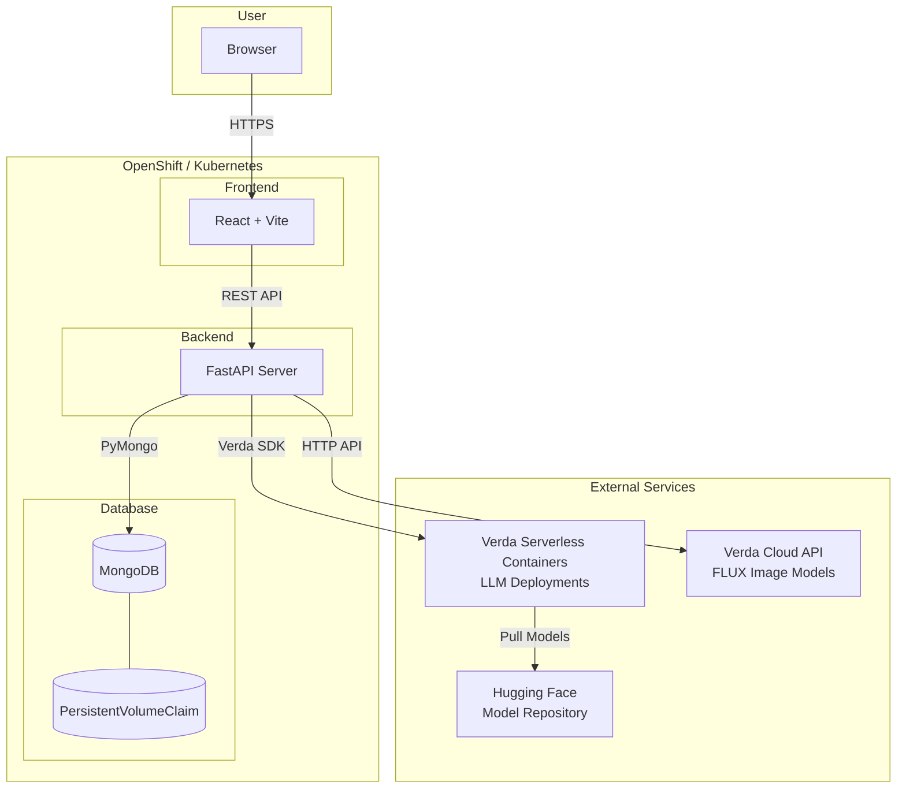
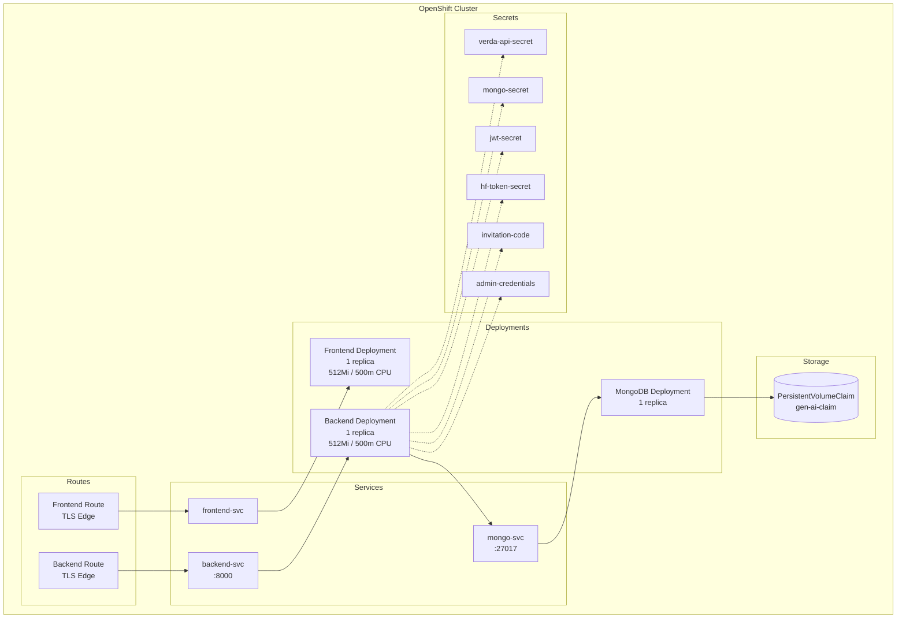

# Architecture Description

---

## System Architecture

```mermaid
graph TB
    subgraph User
        Browser[Browser]
    end

    subgraph OpenShift / Kubernetes
        subgraph Frontend
            React[React + Vite]
        end

        subgraph Backend
            FastAPI[FastAPI Server]
        end

        subgraph Database
            MongoDB[(MongoDB)]
            PVC[(PersistentVolumeClaim)]
        end

        MongoDB --- PVC
    end

    subgraph External Services
        VerdaSC[Verda Serverless Containers<br/>LLM Deployments]
        VerdaAPI[Verda Cloud API<br/>FLUX Image Models]
        HuggingFace[Hugging Face<br/>Model Repository]
    end

    Browser -->|HTTPS| React
    React -->|REST API| FastAPI
    FastAPI -->|PyMongo| MongoDB
    FastAPI -->|Verda SDK| VerdaSC
    FastAPI -->|HTTP API| VerdaAPI
    VerdaSC -->|Pull Models| HuggingFace
```
---

## Deployment Architecture (OpenShift)

```mermaid
graph TB
    subgraph OpenShift Cluster
        subgraph Routes
            FrontRoute[Frontend Route<br/>TLS Edge]
            BackRoute[Backend Route<br/>TLS Edge]
        end

        subgraph Services
            FrontSvc[frontend-svc]
            BackSvc[backend-svc<br/>:8000]
            MongoSvc[mongo-svc<br/>:27017]
        end

        subgraph Deployments
            FrontDep[Frontend Deployment<br/>1 replica<br/>512Mi / 500m CPU]
            BackDep[Backend Deployment<br/>1 replica<br/>512Mi / 500m CPU]
            MongoDep[MongoDB Deployment<br/>1 replica]
        end

        subgraph Storage
            PVC[(PersistentVolumeClaim<br/>gen-ai-claim)]
        end

        subgraph Secrets
            S1[verda-api-secret]
            S2[mongo-secret]
            S3[jwt-secret]
            S4[hf-token-secret]
            S5[invitation-code]
            S6[admin-credentials]
        end

        FrontRoute --> FrontSvc --> FrontDep
        BackRoute --> BackSvc --> BackDep
        BackDep --> MongoSvc --> MongoDep
        MongoDep --> PVC
        BackDep -.-> S1 & S2 & S3 & S4 & S5 & S6
    end
```

---
